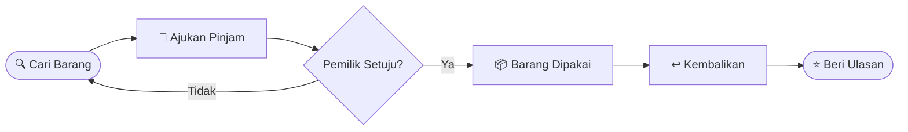

  

  

  
  
  
  

  

---

<h2 align="center">📖 Tentang PinjamKuy</h2>

  Banyak orang butuh barang hanya untuk sekali pakai, seperti <b>kamera, tenda, proyektor, atau buku kuliah</b>. 
  Membelinya terasa boros, sementara banyak barang menganggur di rumah orang lain.  
  <b>PinjamKuy</b> mempertemukan keduanya. Alurnya mirip marketplace, tetapi barangnya <b>dipinjam, bukan dibeli</b>. 🤝

---

<h2 align="center">✨ Fitur Utama</h2>

<table align="center">
  <tr>
    <td align="center" width="180">🔐 <b>Akun Pengguna</b> Registrasi dan login aman</td>
    <td align="center" width="180">📦 <b>Katalog Barang</b> Jelajahi semua barang</td>
    <td align="center" width="180">🔍 <b>Cari dan Filter</b> Temukan barang cepat</td>
  </tr>
  <tr>
    <td align="center" width="180">📝 <b>Pengajuan Pinjam</b> Pilih tanggal, tunggu persetujuan</td>
    <td align="center" width="180">💬 <b>Chat</b> Ngobrol dengan pemilik</td>
    <td align="center" width="180">⭐ <b>Ulasan</b> Rating dan komentar</td>
  </tr>
</table>

---

<h2 align="center">🔄 Alur Peminjaman</h2>

---

<h2 align="center">👥 Tim Kami</h2>

<table align="center">
  <tr>
    <td align="center" width="300">
      
      <h2>Asrianda Imam</h2>
        
      
    </td>
    <td align="center" width="300">
      
      <h2>Muhammad Isfa</h2>
        
      
    </td>
    <td align="center" width="300">
      
      <h2>Wibi Hidayat</h2>
        
      
    </td>
  </tr>
</table>

  Program Studi Informatika · Fakultas Sains dan Teknologi · Universitas Samudra

---

<h2 align="center">🎨 Wireframe Desktop</h2>

<b>🖼️ Klik untuk melihat wireframe</b>

 

  

---

<h2 align="center">🛠️ Teknologi</h2>

  

---

<h2 align="center">🗺️ Roadmap</h2>

| Sprint | Target | Status |
|--------|--------|--------|
| **Sprint 1** | Perancangan: backlog, arsitektur, ERD, wireframe, flowchart | ✅ Selesai |
| **Sprint 2** | Registrasi, login, tambah barang, katalog | ⏳ Berikutnya |
| **Sprint 3** | Pengajuan dan persetujuan peminjaman | ⏳ Rencana |
| **Sprint 4** | Chat, ulasan, dan finalisasi | ⏳ Rencana |

---

  

  <b>PinjamKuy © 2026</b>

  

